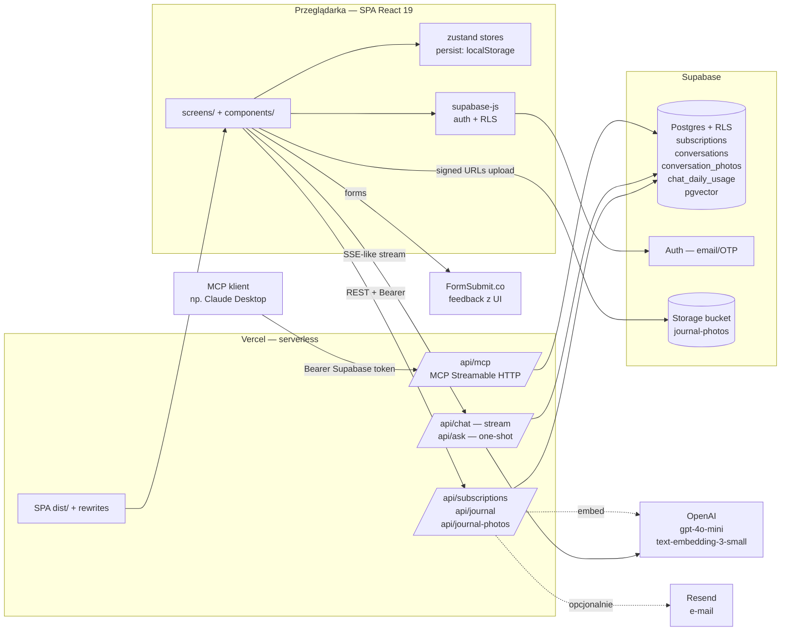

# Architektura — Ostatni Dzień

Dokument opisuje rzeczywisty stan kodu w repo `w1` (branch `main`, czerwiec 2026). Bazuje wyłącznie na plikach źródłowych, `package.json`, `vercel.json`, `.env.example` i kodzie w `api/`, `src/`, `scripts/`.

## 1. Przegląd systemu

Ostatni Dzień to webowa aplikacja (PWA-like, mobile-first) chroniąca użytkownika przed niechcianymi odnowieniami subskrypcji i pobraniami po triallach. Frontend to SPA w React 19 + Vite + Tailwind, hostowany na Vercel. Backend to zestaw bezstanowych funkcji Node na Vercel (`api/*.ts`) operujących na Supabase (Postgres + Auth + Storage + pgvector) — przechowuje subskrypcje użytkownika, dzienniczek rozmów z agentem "Subskrypcik" i zdjęcia załączone do wpisów. Dodatkowo eksponowany jest serwer **MCP (Streamable HTTP)** pod `/api/mcp` z trzema toolami CRUD na subskrypcjach + odczyt dzienniczka, autoryzowany tym samym tokenem Supabase co REST.

## 2. Diagram architektury

## 3. Komponenty

### Frontend (SPA)
| Moduł | Odpowiedzialność | Technologia |
|---|---|---|
| `src/App.tsx` | Routing (`/onboarding`, `/`, `/sub/:id`, plus `Docs`, `SignIn`), `AnimatePresence` fade+scale | react-router-dom v7, framer-motion |
| `src/screens/` | `Dashboard`, `Action`, `Onboarding`, `SignIn`, `Docs` | React 19 |
| `src/components/` | `ui/` (Button, Tag, Toast, ConfirmDialog, Toggle), `cards/` (SubCard, SubLogo), `charts/MiniChart`, `layout/` (PhoneFrame, StatusBar), `smartinput/` (SourceSheet→ProcessingScreen→AddForm→SuccessScreen), `chat/` (ChatSheet, JournalView, AskBar, ActionChips, WelcomeIntro), `editor/RichTextEditor` (Tiptap), `settings/`, `notifications/`, `docs/` (zakładki API + MCP) | Tailwind v3, framer-motion |
| `src/store/` | `subscriptions`, `onboarding`, `settings`, `notifications` — zustand + middleware `persist` w `localStorage` (klucze `ostatni-dzien-subs`, `ostatni-dzien-onboarding`) | zustand v5 |
| `src/lib/supabase.ts` | Klient Supabase z `persistSession + autoRefreshToken + detectSessionInUrl` | `@supabase/supabase-js` |
| `src/lib/auth.ts`, `components/AuthGate.tsx` | Bramka logowania + obsługa sesji | — |
| `src/lib/mappers.ts` | Mapowanie wiersz DB ↔ typ `Subscription` UI | — |
| `src/data/mock.ts`, `data/journal.ts` | Mock seed do pierwszego uruchomienia + fixtures | — |

### Backend (Vercel functions, runtime `nodejs`)
| Endpoint | Metoda | Odpowiedzialność |
|---|---|---|
| `api/subscriptions/index.ts` | `GET`, `POST` | Lista active+paused / dodanie nowej subskrypcji usera |
| `api/subscriptions/[id].ts` | `PATCH` | Zmiana statusu (`active` / `paused` / `cancelled`) |
| `api/chat.ts` | `POST` | Subskrypcik — agent czatu z tool-callami; streaming tokenów (`Transfer-Encoding: chunked`); model `gpt-4o-mini` (override `SUBSKRYPCIK_MODEL`); dzienny limit 20 wiadomości / user |
| `api/ask.ts` | `POST` | One-shot Q&A (bez streamingu, bez tooli mutujących) — wspólny licznik z `/api/chat` |
| `api/journal.ts` | `GET`, `POST` (`action="finalize"`) | Odczyt dzienniczka rozmów dla zakresu dat; finalizacja sesji ≥4 wiadomości → klasyfikacja + streszczenie LLM → insert do `conversations` + embedding |
| `api/journal-photos.ts` | `POST`, `DELETE` | Załączniki do wpisów dzienniczka (bucket `journal-photos`, max 6/wpis, ≤10 MB, JPEG/PNG/WEBP/HEIC) |
| `api/mcp.ts` | `POST` MCP Streamable HTTP | Serwer MCP `name: 'ostatni-dzien' v0.1.0` z toolami: `list_subscriptions`, `add_subscription`, `update_subscription_status`, `list_journal_entries` |
| `api/_shared/auth.ts` | — | Walidacja Bearer = Supabase access token; zwraca klienta z RLS |
| `api/_shared/rate-limit.ts` | — | `chat_daily_usage`, upsert na `(user_id, date)`, `DAILY_MESSAGE_LIMIT=20` |
| `api/_shared/embeddings.ts` | — | `text-embedding-3-small` (1536 dim), helpers `embedQuery`, `toPgVector`, batch po 96 |
| `api/_shared/categories.ts` | — | Taksonomia 7 kategorii (media_vod, audio_podcasts, design_creative, ai_tools, productivity_cloud, shopping_gaming, other) |
| `api/_shared/format.ts` | — | `formatSubDate`, `sectionFor` (Dziś/Ten tydzień/…), `urgencyFor` |
| `api/_shared/prompt.ts` | — | `SYSTEM_PROMPT` agenta Subskrypcik |
| `api/_market.ts` | — | Wbudowany katalog ofert rynkowych (Netflix, Spotify, …) do tool `get_market_offer` |

### Skrypty operacyjne (`scripts/`)
| Plik | Cel |
|---|---|
| `seed-demo-user.ts` | Idempotentny seed konta demo („Testuj aplikację") — subskrypcje + rozmowy + zdjęcia, używa `SUPABASE_SERVICE_ROLE_KEY` |
| `clone-to-demo-user.ts` | Klonowanie danych do usera demo |
| `seed-journal.ts` | Seed samego dzienniczka |

Uruchamiane lokalnie: `npx tsx scripts/<plik>.ts`.

## 4. Źródła danych

### Postgres (Supabase) — tabele wykryte w kodzie
| Tabela | Treść | Dostęp |
|---|---|---|
| `subscriptions` | `id, name, amount_pln, date, days_until, type, status, category, user_id` | RLS, czyt./pisane z `/api/subscriptions/*`, `/api/mcp`, `/api/chat` (tool-calls) |
| `conversations` | wpisy dzienniczka: `category, title, summary, started_at, ended_at`, embedding | `/api/journal`, `/api/mcp` (`list_journal_entries`) |
| `conversation_photos` | zdjęcia załączone do wpisu: `storage_path, mime_type, size_bytes, position, …` | `/api/journal-photos` (RLS) |
| `chat_daily_usage` | licznik wiadomości / user / dzień (UTC) — `(user_id, date) → message_count` | upsert w `rate-limit.ts` |

### Wektoryzacja
pgvector — wektory 1536-wymiarowe z OpenAI `text-embedding-3-small`, bez chunkowania (wpisy ≤ ~500 znaków). Używane do hybrydowego wyszukiwania w dzienniczku rozmów.

### Storage
Bucket **`journal-photos`** — pliki zdjęć dzienniczka; klient pobiera signed URLs (`createSignedUrls(..., 3600)`).

### LocalStorage (klient)
- `ostatni-dzien-subs` — zustand persist store subskrypcji (mock seed przy pierwszym uruchomieniu, gdy user niezalogowany).
- `ostatni-dzien-onboarding` — flaga `done`.
- `sessionStorage: open-adder-after-onboarding` — most między onboardingiem a Smart Inputem.

### Statyczne dane wbudowane
- `api/_market.ts` — auto-generowany katalog ofert (nazwa, plany cenowe PLN, metoda anulowania, alternatywy) używany przez tool `get_market_offer` w `/api/chat`.
- `src/data/mock.ts` — fixtures UI.

## 5. Integracje i połączenia

| Integracja | Kierunek | Uwierzytelnianie | Użycie |
|---|---|---|---|
| **Supabase Auth** | klient → Supabase | email/OTP, session token w `localStorage` (persistSession) | logowanie usera, sesja SPA |
| **Supabase PostgREST + RLS** | klient → Supabase (czytanie własnych danych); backend → Supabase (Bearer = user token) | Bearer `access_token` przekazywany z klienta do `api/*` przez nagłówek `Authorization`; RLS pilnuje że user widzi tylko swoje wiersze | wszystkie CRUDy |
| **Supabase Storage** | klient ↔ Supabase | ten sam token; signed URLs do odczytu | bucket `journal-photos` |
| **OpenAI API** | backend → OpenAI (out) | `OPENAI_API_KEY` (server-side, brak prefiksu `VITE_`) | `gpt-4o-mini` (chat, finalizacja dzienniczka); `text-embedding-3-small` (embeddingi) |
| **MCP server `ostatni-dzien` v0.1.0** | klient MCP (np. Claude Desktop) → `POST /api/mcp` | Bearer Supabase `access_token` (`withMcpAuth` → `authenticateToken`) | tools: `list_subscriptions`, `add_subscription`, `update_subscription_status`, `list_journal_entries` |
| **Resend** | backend → Resend (out) | `resend` SDK, klucz z env [do weryfikacji — pakiet w `dependencies`, nazwa env nieujawniona w `.env.example`] | wysyłka e-maili (transactional) |
| **FormSubmit.co** | klient → FormSubmit (out) | brak — formularz HTML, adres odbiorcy zaszyty w `SettingsSheet.tsx` (`FEEDBACK_EMAIL`) | „Napisz do nas" z UI |
| **Vercel hosting + functions** | — | — | hosting SPA + runtime Node serverless |

### Tooling agenta w `/api/chat`
Function-calling OpenAI z toolami: `get_user_subscriptions`, `add_subscription`, `delete_subscription`, `change_subscription_status`, `get_market_offer`. Mutujące tooli wymagają zalogowanego usera (RLS).

## 6. Przepływ danych

**Logowanie i dane podstawowe.** User loguje się w `SignIn` przez Supabase Auth. Klient (`src/lib/supabase.ts`) trzyma sesję w `localStorage`. Po wejściu na `/` `Dashboard` pobiera subskrypcje (`GET /api/subscriptions` z Bearer). Niezalogowany user widzi mock z `src/data/mock.ts` przez zustand persist.

**Dodanie subskrypcji (Smart Input).** `SmartInputFlow` overlay: `SourceSheet` → fake OCR `ProcessingScreen` (3 s) → `AddForm` (pre-fill *celowo niedokładnymi* AI guessami, badge „AI" znika po edycji — human-in-the-loop) → `SuccessScreen`. Po potwierdzeniu: `POST /api/subscriptions` (lub bezpośrednio do store gdy gość).

**Czat z agentem (Subskrypcik).** UI (`ChatSheet`) wysyła `POST /api/chat` z całą historią. Backend: auth → `checkAndIncrementDailyUsage` (limit 20/dzień) → OpenAI z `SYSTEM_PROMPT` + tools. Pętla tool-call: model woła tool (np. `add_subscription`) → backend wykonuje na Supabase z RLS użytkownika → wynik wraca do modelu → finalne tokeny streamowane do klienta (chunked).

**Dzienniczek rozmów.** Po zakończeniu sesji czatu (≥4 wiadomości) frontend woła `POST /api/journal` z `action="finalize"`. Backend prosi LLM o JSON `{category, title, summary}`, liczy embedding, INSERT do `conversations`. Krótsze sesje są pomijane (gating). Zdjęcia: klient uploaduje do bucketu `journal-photos`, potem `POST /api/journal-photos` z metadanymi; `DELETE` kasuje rekord + plik.

**MCP (długoterminowa pamięć / integracje zewnętrzne).** Klient MCP łączy się do `/api/mcp` z Bearer = Supabase token. `mcp-handler` + `withMcpAuth` waliduje token, rejestrowane są 4 toole — operują na tych samych tabelach co REST, z tą samą RLS.

**Bramki human-in-the-loop:** (1) korekta AI guessów w `AddForm`; (2) `ConfirmDialog` przy „Usuń z listy" (rozróżnienie usunięcia z appki vs anulowania usługi); (3) na ekranie akcji primary CTA „Anuluj w [X]" otwiera deep link / instrukcję — user wykonuje sam.

## 7. Hosting i deployment

- **Vercel** (`vercel.json`): framework `vite`, `buildCommand: npm run build`, `outputDirectory: dist`. Rewrite `"/((?!api/).*)" → /index.html` (SPA history fallback; `/api/*` trafia do funkcji serverless).
- **Build**: `tsc -b && vite build`. Wymóg: Node 20+ (README).
- **Funkcje serverless** w `api/` — runtime `nodejs` (eksport `export const config = { runtime: 'nodejs' }` w `api/mcp.ts`; reszta funkcji to `@vercel/node` handlery).
- **Lokalny dev**: `npm run dev` → Vite na `:5173`; node z `nvm` (workaround w `.claude/launch.json` — patrz `CLAUDE.md §10.1`).
- **Skrypty seedujące** uruchamiane ręcznie z lokalnej maszyny (`npx tsx scripts/...`), wymagają `SUPABASE_SERVICE_ROLE_KEY`.
- **Brak crona, tmux, dockera, kolejek.** Nie znaleziono `Dockerfile`, `docker-compose.yml`, ani plików `vercel.json#crons`.

### Zmienne środowiskowe (nazwy i rola — bez wartości)
| Nazwa | Strona | Rola |
|---|---|---|
| `VITE_SUPABASE_URL` | klient | URL projektu Supabase |
| `VITE_SUPABASE_ANON_KEY` | klient | publishable / anon key Supabase |
| `SUPABASE_URL` | server (Vercel) | URL projektu (fallback: `VITE_SUPABASE_URL`) |
| `SUPABASE_ANON_KEY` | server | anon key dla `authenticateToken` (fallback: `VITE_SUPABASE_ANON_KEY`) |
| `OPENAI_API_KEY` | server | klucz OpenAI (chat + embeddingi) |
| `SUBSKRYPCIK_MODEL` | server, opcjonalnie | nadpisanie modelu czatu (domyślnie `gpt-4o-mini`) |
| `SUBSKRYPCIK_SUMMARY_MODEL` | server, opcjonalnie | model summarizera dzienniczka |
| `OPENAI_EMBED_MODEL` | server, opcjonalnie | model embeddingów |
| `SUPABASE_SERVICE_ROLE_KEY` | tylko skrypty seedujące | bypass RLS dla seedu konta demo |

## 8. Otwarte pytania / TODO

- **Resend** — pakiet jest w `dependencies`, ale w przejrzanym kodzie `api/*` nie znaleziono call-site'u; nazwa env (np. `RESEND_API_KEY`) nieujawniona w `.env.example`. [do weryfikacji — gdzie i kiedy wysyłany jest e-mail]
- **Schemat tabel** odtworzony z zapytań w kodzie (`select(...)`, `insert(...)`); brak katalogu `supabase/migrations/` w repo → faktyczne typy kolumn, indeksy, polityki RLS i definicja funkcji pgvector tylko po stronie projektu Supabase. [do weryfikacji w panelu Supabase]
- **Rate limit** `chat_daily_usage` używa dat UTC — brak informacji w kodzie, czy istnieje job czyszczący starsze wpisy. [do weryfikacji]
- **MCP** — `withMcpAuth` z `mcp-handler` v1.1.0: szczegóły handshake/transportu (`Streamable HTTP`) nieudokumentowane lokalnie. [do weryfikacji w docs `mcp-handler`]
- **`FEEDBACK_EMAIL`** w `SettingsSheet.tsx` — zaszyty na sztywno; brak rotacji. [świadoma decyzja vs. TODO]
- Brak testów automatycznych — weryfikacja wyłącznie wizualna przez Vite preview (CLAUDE.md §10.9).
